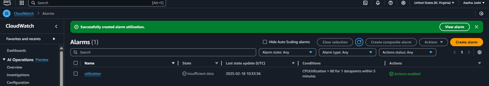
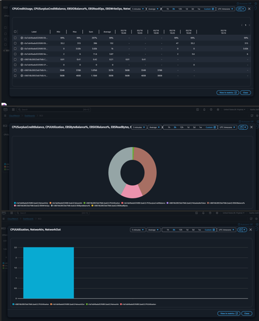

# AWS_Cloud_Monitoring

*COMPANY*: CODTECH IT SOLUTIONS 

*NAME*: Aastha Joshi

*INTERN ID*: CT08OHH

*DOMAIN*: CLOUD COMPUTING

*BATCH DURATION*: JANUARY 20,2025 to FEBRUARY 20,2025

*MENTOR NAME*: NEELA SANTOSH

# Description

### **Amazon EC2 (Elastic Compute Cloud):** ###
Is a cloud-based virtual server that provides scalable and on-demand computing power, helping businesses reduce hardware costs and deploy applications faster. It allows users to launch, configure, and manage virtual servers called EC2 instances, with various instance types offering different hardware configurations. EC2 enables easy scaling, allowing users to increase capacity to handle traffic spikes or reduce capacity when demand decreases.

### **Amazon CloudWatch:** ###
Is a real-time monitoring service that collects and tracks metrics from AWS resources and applications. It provides insights into system performance, automatically displaying metrics for AWS services and allowing users to create custom dashboards for monitoring specific applications. CloudWatch also enables users to set up alarms that trigger notifications or automated actions when predefined thresholds are met.

### **Amazon CloudWatch Dashboards:** ###
Offer a centralized, customizable view of AWS resources across multiple regions. They allow users to monitor key metrics, visualize trends, and create operational playbooks for efficient incident response. By customizing dashboards with selected metrics, alarms, and color-coded graphs, teams can enhance visibility and streamline communication during critical events. Together, EC2 and CloudWatch provide a robust solution for managing, monitoring, and optimizing cloud-based applications.

# Task:
- SET UP MONITORING FOR A CLOUDBASED APPLICATION USING AWS CLOUDWATCH.

# Procedure:

**Step 1: Create an EC2 Instance:**
1. Access the AWS EC2 Console:
   - Begin by opening the AWS Management Console and navigating to the EC2 service, or use the search feature to locate it quickly.

2. Launch a New Instance:
   - Click on the "Launch Instance" button to initiate the process of creating a new EC2 instance.

3. Choose an Amazon Machine Image (AMI):
   - An Amazon Machine Image (AMI) is a pre-configured template that includes the essential software, operating system, and application environment needed to launch an EC2 instance on AWS. AMIs facilitate the rapid deployment of instances with consistent configurations, thereby minimizing setup time and enabling scalability.
   - Select the Amazon Linux AMI, which provides a stable and performant environment for various applications.

4. Choose the Instance Type:
   - Opt for the t2.micro instance type, which is well-suited for basic web applications and qualifies for the AWS Free Tier.

5. Select the Key Pair:
   - Create a new key pair named **task_2** to enable SSH access to the instance securely.

6. Configure Network Settings:
   - Enable the option for a Public IP address, ensuring the instance can access the internet.
   - Allow HTTP traffic by opening port 80 to enable access to the web application hosted on the instance.

7. Launch the Instance:
   - Finally, click on the "Launch Instance" button and wait for the instance to initialize. Once launched, you will be able to access it according to the configured settings.

**Step 2: Set Up CloudWatch Alarms**
1. Access the AWS CloudWatch Console:
   - Begin by opening the CloudWatch service from the AWS Management Console, which provides advanced monitoring capabilities for your AWS resources.

2. Create an Alarm:
   - Click on the Alarms section and then select "Create Alarm" to initiate the alarm configuration process.

3. Choose a Metric:
   - Click on "Select metric," then navigate to EC2 and select "Per-instance Metrics."
   - Choose the relevant metric to monitor, such as CPUUtilization, or alternatively select another metric like Network In/Out.

4. Set the Condition:
   - We specify the condition for the alarm: set the threshold to trigger if CPU Utilization exceeds 80% for two consecutive periods, which will help in identifying instances that may be overutilized.

5. Set Actions:
   - Under the Actions section, we choose "EC2 Actions" and select the option to "Stop this instance." This action will automatically stop the EC2 instance when the defined threshold is reached, helping to prevent resource exhaustion.

6. Review and Create:
   -  Click "Next" to proceed to the review phase. Examine the alarm configuration details to ensure accuracy, then click "Create Alarm" to finalize the setup. This alarm will now actively monitor your specified metrics and execute the defined actions when the conditions are met.
  

**Step 3: Monitor Application Using CloudWatch Metrics**
1. Access the EC2 Console:
   - Begin by opening the EC2 Dashboard from the AWS Management Console, which allows for the management of your Amazon Elastic Compute Cloud (EC2) instances.

2. Access CloudWatch Metrics:
   - Navigate to the Monitoring section and select "View all CloudWatch metrics" to explore the various monitoring capabilities available for your EC2 instances.

3. Select Metrics to Monitor:
   - Click on EC2 and then select "Per-instance Metrics" to view the metrics specific to each EC2 instance.
   - Choose relevant metrics to monitor, such as:
     - EBS Write Operations, which tracks the number of write operations on your Elastic Block Store (EBS) volumes.
     - Network In/Out, which indicates the volume of network traffic entering and leaving your instances.
     - CPU Utilization, which measures the percentage of allocated EC2 compute units that are being used.

4. View Metrics Graphs:
   - After selecting the desired metrics, you will be presented with real-time graphs that visually represent the performance of the chosen metrics, enabling you to closely monitor system activity and resource utilization.

**Step 4: Create a CloudWatch Dashboard:**
1. Access the CloudWatch Dashboard:
   - Begin by launching the CloudWatch service from the AWS Management Console. This tool provides comprehensive monitoring for AWS resources and applications.
   - Proceed to initiate the creation of a new dashboard, which will serve as a customized interface for visualizing relevant metrics.

2. Navigate to Dashboards > Create Dashboard:
   - Input a descriptive and relevant name for the dashboard that reflects its purpose and the specific metrics it will monitor.
   - Enhance the dashboard by adding various widgets that will display data in a meaningful way.

3. Select the Desired Widget Type (Graph, Number, Table):
   - Carefully choose the appropriate widget type depending on the type of data representation required. Options include Graphs for trend analysis, Numbers for displaying key performance indicators, and Tables for detailed tabular data.
   - Designate CloudWatch as the data source to ensure accurate and real-time data visualization.
   - Identify and select the specific metrics that require monitoring, ensuring they align with your operational and business objectives.

4. Click "Save" to Complete the Configuration of the Monitoring Dashboard:
   - After customizing the dashboard with the selected widgets and metrics, click the "Save" button to finalize your configurations. This will enable you to monitor the chosen metrics effectively and make informed decisions based on the data presented.
  

